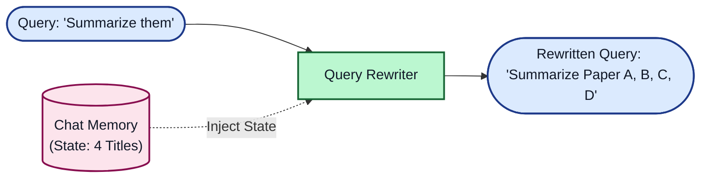
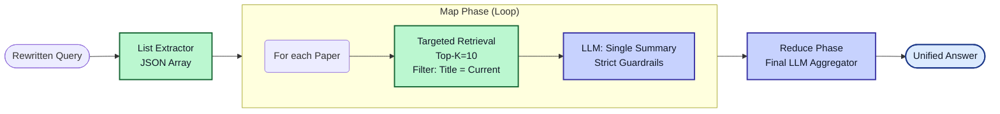

# Beyond "LLM In / LLM Out"

Architecting a Sovereign Chatbot for the NUM / RMaP Consortium

<div class="abs-br m-6 flex gap-2">
 Philipp Wiesenbach | Dieterich Lab | June 2026
</div>

---
layout: default
---

# The Mission

**The Goal:** Provide the RMaP Consortium (and later the NUM) with a secure, on-premise AI assistant to navigate complex guidelines, governance documents, and metadata catalogs.

**The Constraints:**

- Absolute Data Privacy: No OpenAI APIs. Local deployment only (vLLM / Ollama).
- Heterogeneous Data: PDFs, web scrapes, double-column Nature papers, governance tables.
- High Accuracy: "Hallucinations" about grant deadlines or cohort sizes are unacceptable.

**The Naive Assumption:**
> *"Just throw the PDFs into a Vector Database, connect Llama-3, and we're done."*

---
layout: default
---

# The Reality: Naive RAG fails

Why a simple Vector-RAG approach crashes in clinical/research environments.

**The Pipeline:**

1. Chunk the PDF (e.g., 1000 tokens).
2. Create Vectors (Embeddings).
3. Search Top-K (e.g., 5 chunks).
4. Send to LLM.

**The Fatal Flaw:**
Vector databases measure semantic similarity, not factual truth or document structure.

::right::

<br>
<br>

<div class="bg-red-100 p-4 rounded-md text-red-900 shadow-md">
 <b>Example Failure:</b><br>
 <i>User:</i> "Which papers were published by Mark Helm?"<br>
 <i>System:</i> "I don't know." (or hallucinates)
</div>

<br>

**Why? The "Top-K" Bottleneck:**
If Mark Helm wrote 25 papers, but Top-K is set to 5, the LLM literally cannot see the other 20 papers. It is mathematically impossible for Vector-RAG to aggregate lists across a whole database.

---
layout: default
---

# The "Smart BS" Illusion (Parametric Memory Leak)

When RAG fails, strong LLMs try to help anyway.

If the Vector DB fails to fetch the correct abstract for a paper, but provides the title (e.g., from a bibliography chunk), the LLM relies on its **pre-training knowledge**.

<div class="grid grid-cols-2 gap-4 mt-4">
 <div>
  <div class="bg-gray-100 text-gray-900 p-4 rounded-md h-full">
   <b>What the LLM sees (Context):</b><br>
  <span class="text-sm text-gray-900 font-mono">Chunk 1: "References: 14. Dieterich C, 2025, Nucleic Acids Res..."</span><br>
  <span class="text-sm text-gray-900 font-mono">Chunk 2: "![image] ![image] © Oxford Univ Press"</span>
  </div>
 </div>
 <div>
  <div class="bg-yellow-100 text-gray-900 p-4 rounded-md h-full border border-yellow-400">
   <b>The LLM's Internal Monologue (&lt;think&gt;):</b><br>
   <span class="text-sm text-gray-800"><i>"I don't have the abstract for Dieterich 2025. But I know the title. I will write a plausible summary based on my training data."</i></span><br>
   <b>Result:</b> A perfectly written, scientifically plausible, but completely hallucinated summary.
  </div>
 </div>
</div>

<div class="mt-8 font-bold text-center text-red-600">
Conclusion: We needed to regain control over the retrieval and generation process.
</div>

---
layout: center
class: text-center
---

# Enter: Agentic Workflow & Semantic Routing

We migrated to **Dify.ai** to build a modular, multi-path architecture.

---
layout: default
---

# The New Architecture: Semantic Routing

We decouple *content queries* from *metadata queries* using a Classifier.


---
layout: default
---

# Routing in Action: The Dual Path

How the system behaves under the hood based on the classifier's decision.

Route A: Content (RAG)

Query: "What is the mechanism of Queuosine?"

- Retrieval: Vector Database.
- Search Space: 50,000 chunks.
- Method: Hybrid Search (Cosine Similarity + BM25).
- Output: Top 10 chunks containing specific abstracts/methods.

::right::

Route B: Metadata (GraphQL)

Query: "Which papers did Mark Helm publish?"

- Parameter Extraction: `{"author": "Mark Helm"}`
- Retrieval: Python Code Node.
- Method: Deterministic database query.
- Output:

```graphql
{
  Get {
    Document(
      where: {
        path: ["authors"]
        operator: Like
        valueText: "*Mark Helm*"
      }
    ) {
      title
      year
    }
  }
}
```


---
layout: default
---

# The Boss Level: Multi-Document Summarization

> *"Please summarize the 4 papers by Christoph Dieterich."*

Why this is hard:

- Multi-turn context: "summarize them" must resolve to the 4 titles from the previous turn.
- Retrieval precision: only those 4 papers should be fetched.
- Context limits: loading all full texts at once causes loss-in-the-middle and hallucinations.

<div class="mt-4 p-4 rounded-md bg-blue-50 border border-blue-200 text-blue-900">
  <b>Design principle:</b> Resolve state first, then summarize iteratively.
</div>

<div class="mt-4 text-sm text-slate-900 font-medium bg-slate-100 border border-slate-300 rounded-md px-3 py-2">
  Pipeline: <b>State Resolution</b> -> <b>Targeted Retrieval</b> -> <b>Map-Reduce Aggregation</b>
</div>

---
layout: default
---

# The Solution: State Management & Iterative Map-Reduce

We designed a highly isolated, conversational loop architecture to prevent hallucinations and context overflow.

### Step 1: Resolving Conversational State
Before routing, an LLM rewrites the query using the chat history to inject explicit metadata anchors.



---
layout: default
---

# The Solution: State Management & Iterative Map-Reduce (Part 2)

### Step 2: Isolated Map-Reduce
The rewritten query is split into an array. Each paper is processed in isolation.



  <div class="mt-2 text-[0.74rem] leading-tight bg-slate-50 border border-slate-200 rounded-md p-2 text-slate-800">
    <div class="font-semibold mb-1">Execution Trace (under the hood)</div>
    <div class="grid grid-cols-2 gap-2">
      <div>
        <b>Context</b><br>
        - Turn 1: ask for Dieterich papers -> save <i>Paper A</i> + <i>Paper B</i> to memory.<br>
        - Turn 2: "Please summarize them."<br>
        - Rewrite: "Summarize Paper A and Paper B."
      </div>
      <div>
        <b>Pipeline</b><br>
        - Extract: <span class="font-mono">['Paper A', 'Paper B']</span><br>
        - Map: A retrieve/summarize + B retrieve/summarize<br>
        - Reduce: aggregate A + B -> final answer
      </div>
    </div>
  </div>

---
layout: default
---

# Lessons Learned & What's Next

Key takeaways for AI engineering in healthcare:

1.  Garbage In, Garbage Out: Poor PDF parsing (double columns, images) destroys
    RAG. We implemented robust text/metadata extraction prior to upload.
2.  Metadata is king: Vector search without hard metadata filters is a gamble.
3.  Guardrails are essential: Hard negative prompting is required to suppress
    the LLM's helpfulness bias.

What's next (the bridge to NUM-ENRICH):

- The current Map-Reduce flow is powerful but computationally expensive.
- The Future is GraphRAG: Moving from flat vectors to Neo4j. Connecting authors, papers, and clinical cohorts natively in a graph enables deterministic, multi-hop reasoning without complex iteration loops or expensive query rewriting. (Sneak peek: CardioGuidelinesGraph)


---
layout: center
class: text-center
---

# Thank You

Questions? (Live demo available at rmap-chatbot-demo-dify.internal)