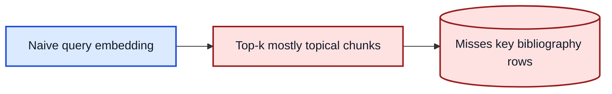
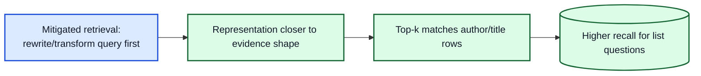
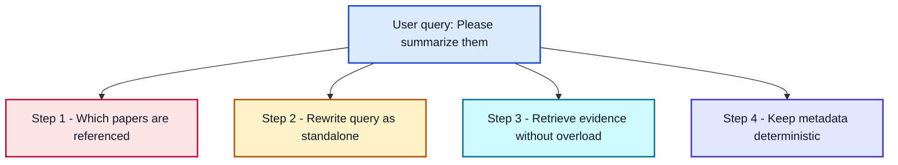
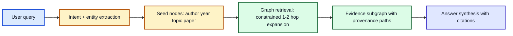

<style>
.hero-chat-slide {
  position: relative;
  min-height: calc(100vh - 96px);
  display: flex;
  align-items: center;
  justify-content: center;
  overflow: hidden;
}

.hero-content {
  position: relative;
  z-index: 2;
  text-align: center;
  max-width: 85%;
}

.hero-content h1 {
  font-size: 2.8rem;
  line-height: 1.05;
  margin-bottom: 0.7rem;
}

.hero-content p {
  font-size: 1.15rem;
  opacity: 0.95;
}

.chat-bg {
  position: absolute;
  inset: 0;
  z-index: 1;
  pointer-events: none;
}

.chat-stream {
  position: absolute;
  left: 2.5%;
  right: 2.5%;
}

.chat-stream.left {
  text-align: left;
}

.chat-stream.right {
  text-align: right;
}

.chat-line {
  display: inline-block;
  position: relative;
  max-width: none;
  font-family: ui-monospace, SFMono-Regular, Menlo, Consolas, monospace;
  font-size: 0.8rem;
  letter-spacing: 0.01em;
  color: rgba(191, 219, 254, 0.3);
  white-space: nowrap;
  overflow: hidden;
  width: 0;
  border-right: 1px solid rgba(191, 219, 254, 0.78);
  animation: typeErase 15.6s steps(120, end) infinite;
}

.chat-line::before {
  content: "";
  position: absolute;
  right: 0;
  top: 8%;
  width: 1.4ch;
  height: 84%;
  background: radial-gradient(circle at 35% 50%, rgba(191, 219, 254, 0.58), rgba(191, 219, 254, 0));
  filter: blur(1.8px);
  opacity: 0.82;
  animation: glowPulse 0.9s ease-in-out infinite;
}

.chat-line.alt {
  color: rgba(110, 231, 183, 0.28);
  border-right-color: rgba(110, 231, 183, 0.78);
}

.chat-line.alt::before {
  background: radial-gradient(circle at 35% 50%, rgba(110, 231, 183, 0.56), rgba(110, 231, 183, 0));
}

@keyframes typeErase {
  0% {
    width: 0;
    opacity: 0;
  }
  8% {
    opacity: 1;
  }
  36% {
    width: calc(var(--chars, 80) * 1ch);
    opacity: 1;
  }
  58% {
    width: calc(var(--chars, 80) * 1ch);
    opacity: 0.95;
  }
  88% {
    width: 0;
    opacity: 0.9;
  }
  100% {
    width: 0;
    opacity: 0;
  }
}

@keyframes caretBlink {
  0%, 45% { opacity: 0.95; }
  46%, 100% { opacity: 0.25; }
}

@keyframes glowPulse {
  0%, 100% { opacity: 0.55; }
  50% { opacity: 0.92; }
}
</style>

<div class="hero-chat-slide">
  <div class="chat-bg">
    <div class="chat-stream left" style="top:8%;">
      <span class="chat-line" style="animation-delay:0s; --chars:108;">User: Which papers did Mark Helm publish in 2025, and can you list journals and years in a compact table?</span>
    </div>
    <div class="chat-stream right" style="top:16%;">
      <span class="chat-line alt" style="animation-delay:1.4s; --chars:121;">Assistant: Applying deterministic author and year filters, then validating journal metadata before response generation...</span>
    </div>
    <div class="chat-stream left" style="top:24%;">
      <span class="chat-line" style="animation-delay:2.7s; --chars:109;">User: Please summarize them and compare methods, limitations, and sequencing setup differences across papers.</span>
    </div>
    <div class="chat-stream right" style="top:32%;">
      <span class="chat-line alt" style="animation-delay:4.1s; --chars:104;">Assistant: Rewritten with memory: summarize Paper A, Paper B, Paper C, and Paper D in requested order.</span>
    </div>
    <div class="chat-stream left" style="top:64%;">
      <span class="chat-line" style="animation-delay:5.3s; --chars:122;">System: Iterative retrieval started with per-paper metadata filters, constrained top-k context, and map-reduce aggregation.</span>
    </div>
    <div class="chat-stream right" style="top:72%;">
      <span class="chat-line alt" style="animation-delay:6.8s; --chars:122;">Assistant: Map phase complete for all requested papers. Running reduce synthesis with strict no-hallucination guardrails...</span>
    </div>
    <div class="chat-stream left" style="top:80%;">
      <span class="chat-line" style="animation-delay:8.2s; --chars:114;">User: Show only Nucleic Acids Res entries from 2025, and keep only exact metadata matches in the final list.</span>
    </div>
  </div>

  <div class="hero-content">
    <h1>Beyond "LLM In / LLM Out"</h1>
    <p>Architecting a Sovereign Chatbot for the NUM / RMaP Consortium</p>
  </div>

  <div class="abs-br m-6 flex gap-2 z-10">
    Philipp Wiesenbach | Dieterich Lab | June 2026
  </div>
</div>

---
layout: default
---

# The Mission

**The Goal:** Provide the RMaP Consortium (and later the NUM) with a secure, on-premise AI assistant to navigate complex guidelines, governance documents, and metadata catalogs.

**The Constraints:**

- Absolute Data Privacy: No OpenAI APIs. Local deployment only (vLLM / Ollama).
- Heterogeneous Data: PDFs, web scrapes, double-column Nature papers, governance tables.
- High Accuracy: "Hallucinations" about grant deadlines or cohort sizes are unacceptable.

**The Naive Assumption:**
> *"Just throw the PDFs into a Vector Database, connect Llama-3, and we're done."*

---
layout: default
---

# The Reality: Naive RAG fails

Why a simple Vector-RAG approach crashes in clinical/research environments.

**The Pipeline:**

1. Chunk the PDF (e.g., 1000 tokens).
2. Create Vectors (Embeddings).
3. Search Top-K (e.g., 5 chunks).
4. Send to LLM.

**The Fatal Flaw:**
Vector databases measure semantic similarity, not factual truth or document structure.

::right::

<br>
<br>

<div class="bg-red-100 p-4 rounded-md text-red-900 shadow-md">
 <b>Example Failure:</b><br>
 <i>User:</i> "Which papers were published by Mark Helm?"<br>
 <i>System:</i> "I don't know." (or hallucinates)
</div>

<br>

**Why? The "Top-K" Bottleneck:**
If Mark Helm wrote 25 papers, but Top-K is set to 5, the LLM literally cannot see the other 20 papers. It is mathematically impossible for Vector-RAG to aggregate lists across a whole database.

---
layout: default
---

# Similarity Trap: Question != Evidence Wording

<div class="text-left text-sm leading-snug">
<b>Observation:</b> the wording of a question is often unlike the wording of the best evidence chunk.

<br>

<b>Query:</b> "Which papers did Mark Helm publish?"

<b>Best evidence shape:</b> author lists and bibliography rows, often without explicit "publish" wording.

<br>

<b>Consequence:</b> pure query-embedding can rank semantically plausible but operationally wrong chunks too high.

<div class="mt-3 p-2 rounded bg-emerald-50 border border-emerald-200 text-emerald-900">
<b>Important:</b> HyDE is one possible trick to improve semantic retrieval alignment, not a mandatory component.
</div>

<div class="mt-2 p-2 rounded bg-sky-50 border border-sky-200 text-sky-900">
<b>Our project choice:</b> Query Rewriter + structured metadata-aware routing (instead of HyDE) to make queries retrieval-ready.
</div>
</div>





---
layout: default
---

# The "Smart BS" Illusion (Parametric Memory Leak)

When RAG fails, strong LLMs try to help anyway.

If the Vector DB fails to fetch the correct abstract for a paper, but provides the title (e.g., from a bibliography chunk), the LLM relies on its **pre-training knowledge**.

<div class="grid grid-cols-2 gap-4 mt-4">
 <div>
  <div class="bg-gray-100 text-gray-900 p-4 rounded-md h-full">
   <b>What the LLM sees (Context):</b><br>
  <span class="text-sm text-gray-900 font-mono">Chunk 1: "References: 14. Dieterich C, 2025, Nucleic Acids Res..."</span><br>
  <span class="text-sm text-gray-900 font-mono">Chunk 2: "![image] ![image] © Oxford Univ Press"</span>
  </div>
 </div>
 <div>
  <div class="bg-yellow-100 text-gray-900 p-4 rounded-md h-full border border-yellow-400">
   <b>The LLM's Internal Monologue (&lt;think&gt;):</b><br>
   <span class="text-sm text-gray-800"><i>"I don't have the abstract for Dieterich 2025. But I know the title. I will write a plausible summary based on my training data."</i></span><br>
   <b>Result:</b> A perfectly written, scientifically plausible, but completely hallucinated summary.
  </div>
 </div>
</div>

<div class="mt-8 font-bold text-center text-red-600">
Conclusion: We needed to regain control over the retrieval and generation process.
</div>

---
layout: center
class: text-center
---

# Enter: Agentic Workflow & Semantic Routing

We migrated to **Dify.ai** to build a modular, multi-path architecture.

---
layout: default
---

# The New Architecture: Semantic Routing

We decouple *content queries* from *metadata queries* using a Classifier.


---
layout: two-cols
---

# Routing in Action: The Dual Path

How the system behaves under the hood based on the classifier's decision.

Route A: Content (RAG)

Query: "What is the mechanism of Queuosine?"

- Retrieval: Vector Database.
- Search Space: 50,000 chunks.
- Method: Hybrid Search (Cosine Similarity + BM25).
- Output: Top 10 chunks containing specific abstracts/methods.

::right::

Route B: Metadata (GraphQL)

Query: "Which papers did Mark Helm publish?"

- Parameter Extraction: `{"author": "Mark Helm"}`
- Retrieval: Python Code Node.
- Method: Deterministic database query.
- Output:

```graphql
{
  Get {
    Document(
      where: {
        path: ["authors"]
        operator: Like
        valueText: "*Mark Helm*"
      }
    ) {
      title
      year
    }
  }
}
```


---
layout: default
---

# The Boss Level: Multi-Document Summarization

> *"Please summarize them."*

One short sentence, four independent failure modes.



<div class="mt-3 p-3 rounded-md bg-slate-100 border border-slate-300 text-slate-900">
<b>Design strategy:</b> solve each failure mode explicitly with one dedicated architectural improvement.
</div>

---
layout: default
---

# Problem 1: Follow-up queries lose context

Without explicit state, "them" is ambiguous and the bot may summarize the wrong papers.

<div class="mt-3 p-3 rounded-md bg-rose-50 border border-rose-200 text-rose-900">
<b>Solution introduced:</b> <b>Conversational Memory</b><br>
Persist paper identities across turns and resolve follow-up references from that memory.
</div>

<div class="mt-2 text-sm font-semibold text-sky-200">Real memory snapshot (conversation.memory)</div>

```json
[
  {
    "title": "Detection of queuosine and queuosine precursors in tRNAs by direct RNA sequencing",
    "authors": "Yu Sun, Michael Piechotta, Isabel Naarmann-de Vries, Christoph Dieterich, Ann E. Ehrenhofer-Murray",
    "year": "2023",
    "journal": "Nucleic Acids Res"
  },
  {
    "title": "Sci-ModoM: a quantitative database of transcriptome-wide high-throughput RNA modification sites",
    "authors": "Etienne Boileau, Harald Wilhelmi, Anne Busch, Andrea Cappannini, Andreas Hildebrand, Janusz M. Bujnicki, Christoph Dieterich",
    "year": "2025",
    "journal": "Nucleic Acids Res"
  }
]
```

---
layout: default
---

# Problem 2: Query text is underspecified

Even with memory, retrieval works poorly if the raw user text is not standalone.

<div class="mt-3 p-3 rounded-md bg-amber-50 border border-amber-200 text-amber-900">
<b>Solution introduced:</b> <b>Question Rewriter</b><br>
Rewrite the user query into a self-contained retrieval query before searching.
</div>

<div class="mt-2 text-sm font-semibold text-sky-200">Real rewrite example</div>

```text
Input query:
Please summarize them.

Conversation memory contains:
- Detection of queuosine and queuosine precursors in tRNAs by direct RNA sequencing (2023)
- Adaptive sampling for nanopore direct RNA-sequencing (2023)
- Detecting m6A at single-molecular resolution via direct RNA sequencing and realistic training data (2024)
- Sci-ModoM: a quantitative database of transcriptome-wide high-throughput RNA modification sites (2025)

Rewritten standalone query:
Please summarize these four papers: Detection of queuosine and queuosine precursors in tRNAs by direct RNA sequencing; Adaptive sampling for nanopore direct RNA-sequencing; Detecting m6A at single-molecular resolution via direct RNA sequencing and realistic training data; Sci-ModoM: a quantitative database of transcriptome-wide high-throughput RNA modification sites.
```

---
layout: default
---

# Problem 3: One-shot retrieval misses evidence

Batching everything at once causes noisy context and loss-in-the-middle.

<div class="mt-3 p-3 rounded-md bg-cyan-50 border border-cyan-200 text-cyan-900">
<b>Solution introduced:</b> <b>Iterative Knowledge Retrieval</b><br>
Process one paper at a time (retrieve -> summarize), then aggregate.
</div>

<div class="mt-2 text-sm font-semibold text-sky-200">Execution model (For each paper)</div>

```python
paper_list = resolve_paper_list(query, memory)
partials = []

for paper in paper_list:
    docs = knowledge_retrieval_with_filter(
        title=paper["title"],
        authors=paper["authors"],
        year=paper["year"],
        top_k=10,
    )
    partials.append(paper_map_llm(paper, docs))

final_answer = reduce_llm(partials, requested_order=paper_list)
```

---
layout: default
---

# Problem 4: Metadata answers must be deterministic

Author/year/journal questions are fragile if answered only via semantic similarity.

<div class="mt-3 p-3 rounded-md bg-indigo-50 border border-indigo-200 text-indigo-900">
<b>Solution introduced:</b> <b>DB Lookup with fixed metadata filter</b><br>
Apply strict metadata constraints (author, year, journal, title) before generating output.
</div>

<div class="mt-2 text-sm font-semibold text-sky-200">Fixed metadata filter example</div>

```json
{
  "author": "Christoph Dieterich",
  "year": "2025",
  "journal": "Nucleic Acids Res",
  "title": "Sci-ModoM"
}
```

<div class="text-[0.64rem] leading-tight">

```graphql
{
  Get{Document(where:{
    operator:And,
    operands:[
      {path:["authors"],operator:Like,valueText:"*Christoph Dieterich*"},
      {path:["year"],operator:Equal,valueText:"2025"}
    ]}){title year}}
}
```

</div>

---
layout: default
---

# Full Chatbot Flow (Simplified)


---
layout: default
---

# The Reality

<div class="text-sky-200 text-sm mb-2">Production view in Dify (complex workflow, condensed in the previous architecture slide)</div>

<div class="h-[calc(100vh-220px)] w-full flex items-start justify-center overflow-hidden">
  
</div>

---
layout: default
---

# Why Graph + Graph Retrieval Changes the Game

<div class="text-sm text-sky-200 mb-2">
One model for both question families: semantic content questions and strict metadata questions.
</div>



<div class="grid grid-cols-2 gap-4 mt-3 text-sm">
  <div class="rounded-md border border-rose-200 bg-rose-50 text-rose-900 p-3">
    <b>Before:</b> Top-k chunk guessing<br>
    Missed links, weak recall, hard to explain why a chunk was chosen.
  </div>
  <div class="rounded-md border border-emerald-200 bg-emerald-50 text-emerald-900 p-3">
    <b>With Graph Retrieval:</b> explicit relations<br>
    Deterministic filters + relational hops + traceable evidence paths.
  </div>
</div>

---
layout: two-cols
---

# One Graph, Two Powerful Modes

Content question (semantic + relational)

<div class="text-[0.86rem] leading-snug">
<b>Query:</b> "How do Helm papers describe queuosine detection?"<br>
1. Seed: <b>Author=Mark Helm</b>, <b>Topic=queuosine</b><br>
2. Topic enters graph during ingestion: keyword/NER mapping -> <b>Topic</b> node<br>
3. Traverse: Author -> Paper -> Section -> Chunk and Chunk -> MENTIONS_METHOD -> Method

<div class="mt-2 p-2 rounded bg-slate-100 border border-slate-300 text-slate-900 text-[0.66rem] leading-tight font-mono">
Author -> Paper -> HAS_TOPIC -> Topic(queuosine)<br>
Paper -> Section -> Chunk -> MENTIONS_METHOD -> Method
</div>

<div class="mt-2 p-2 rounded bg-cyan-50 border border-cyan-200 text-cyan-900 text-[0.8rem]">
Method is a normalized concept node; Chunk remains the raw evidence text with provenance.
</div>
</div>

::right::

GraphQL retrieval examples (same graph)

<div class="text-[0.8rem] leading-snug">
<b>Similarity + constraints:</b> semantic search + metadata filters.
</div>

```graphql
{
  Get {
    Chunk(
      hybrid: { query: "queuosine detection", alpha: 0.6 }
      where: { operator: And, operands: [
        { path: ["paper","authors"], operator: Like, valueText: "*Mark Helm*" },
        { path: ["paper","topics"], operator: Like, valueText: "*queuosine*" }
      ] }
      limit: 5
    ) {
      text
      paper { title year }
      _additional { score }
    }
  }
}
```

<div class="mt-1 p-2 rounded bg-indigo-50 border border-indigo-200 text-indigo-900 text-[0.74rem] leading-snug">
Same graph also supports strict metadata mode (author/year/journal filters).
</div>

---
layout: default
---

# Lessons Learned & What's Next

<div class="grid grid-cols-2 gap-4 mt-3">
  <div class="rounded-md border border-sky-200 bg-sky-50 text-sky-900 p-4">
    <div class="font-bold mb-2">What Worked</div>
    <ul class="text-sm leading-snug">
      <li>Parsing quality first: bad extraction breaks everything downstream.</li>
      <li>Hard metadata constraints: better precision, fewer hallucinations.</li>
      <li>Structured orchestration: rewrite, route, retrieve, then synthesize.</li>
    </ul>
  </div>
  <div class="rounded-md border border-emerald-200 bg-emerald-50 text-emerald-900 p-4">
    <div class="font-bold mb-2">Where We Go Next</div>
    <ul class="text-sm leading-snug">
      <li>Current map-reduce is robust, but expensive at scale.</li>
      <li>Next step: GraphRAG with Neo4j for deterministic multi-hop reasoning.</li>
      <li>Target: production bridge to NUM-ENRICH (CardioGuidelinesGraph).</li>
    </ul>
  </div>
</div>

<div class="mt-4 text-center text-lg font-semibold text-slate-100">
From retrieval heuristics to knowledge-aware reasoning.
</div>


---
layout: center
class: text-center
---

# Thank You

Questions? (Live demo available at rmap-chatbot-demo-dify.internal)