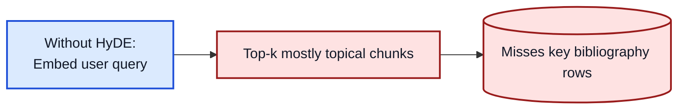
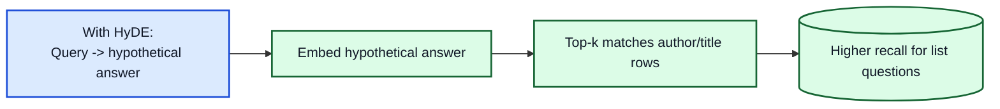
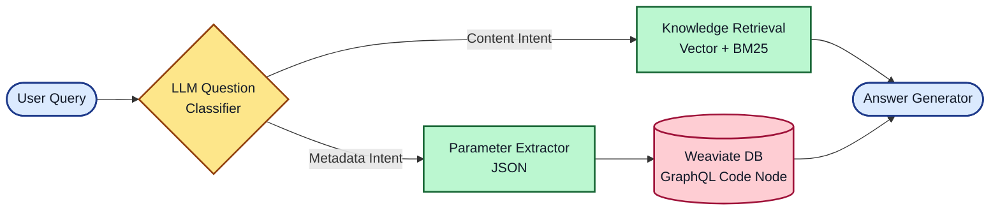
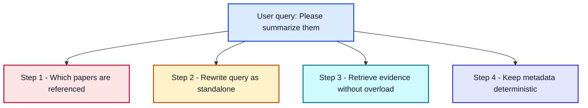

# Beyond "LLM In / LLM Out"

Architecting a Sovereign Chatbot for the NUM / RMaP Consortium

<div class="abs-br m-6 flex gap-2">
 Philipp Wiesenbach | Dieterich Lab | June 2026
</div>

---
layout: default
---

# The Mission

**The Goal:** Provide the RMaP Consortium (and later the NUM) with a secure, on-premise AI assistant to navigate complex guidelines, governance documents, and metadata catalogs.

**The Constraints:**

- Absolute Data Privacy: No OpenAI APIs. Local deployment only (vLLM / Ollama).
- Heterogeneous Data: PDFs, web scrapes, double-column Nature papers, governance tables.
- High Accuracy: "Hallucinations" about grant deadlines or cohort sizes are unacceptable.

**The Naive Assumption:**
> *"Just throw the PDFs into a Vector Database, connect Llama-3, and we're done."*

---
layout: default
---

# The Reality: Naive RAG fails

Why a simple Vector-RAG approach crashes in clinical/research environments.

**The Pipeline:**

1. Chunk the PDF (e.g., 1000 tokens).
2. Create Vectors (Embeddings).
3. Search Top-K (e.g., 5 chunks).
4. Send to LLM.

**The Fatal Flaw:**
Vector databases measure semantic similarity, not factual truth or document structure.

::right::

<br>
<br>

<div class="bg-red-100 p-4 rounded-md text-red-900 shadow-md">
 <b>Example Failure:</b><br>
 <i>User:</i> "Which papers were published by Mark Helm?"<br>
 <i>System:</i> "I don't know." (or hallucinates)
</div>

<br>

**Why? The "Top-K" Bottleneck:**
If Mark Helm wrote 25 papers, but Top-K is set to 5, the LLM literally cannot see the other 20 papers. It is mathematically impossible for Vector-RAG to aggregate lists across a whole database.

---
layout: default
---

# Similarity Trap: Question != Answer

<div class="text-left text-sm leading-snug">
<b>Observation:</b> the wording of a question is often unlike the wording of the best evidence chunk.

<br>

<b>Query:</b> "Which papers did Mark Helm publish?"

<b>Best evidence shape:</b> author lists and bibliography rows, often without explicit "publish" wording.

<br>

<b>Consequence:</b> pure query-embedding can rank semantically plausible but operationally wrong chunks too high.

<div class="mt-3 p-2 rounded bg-emerald-50 border border-emerald-200 text-emerald-900">
<b>HyDE hint:</b> Generate a short hypothetical answer first, embed that text, then retrieve. This shifts search toward answer-shaped evidence.
</div>
</div>





---
layout: default
---

# The "Smart BS" Illusion (Parametric Memory Leak)

When RAG fails, strong LLMs try to help anyway.

If the Vector DB fails to fetch the correct abstract for a paper, but provides the title (e.g., from a bibliography chunk), the LLM relies on its **pre-training knowledge**.

<div class="grid grid-cols-2 gap-4 mt-4">
 <div>
  <div class="bg-gray-100 text-gray-900 p-4 rounded-md h-full">
   <b>What the LLM sees (Context):</b><br>
  <span class="text-sm text-gray-900 font-mono">Chunk 1: "References: 14. Dieterich C, 2025, Nucleic Acids Res..."</span><br>
  <span class="text-sm text-gray-900 font-mono">Chunk 2: "![image] ![image] © Oxford Univ Press"</span>
  </div>
 </div>
 <div>
  <div class="bg-yellow-100 text-gray-900 p-4 rounded-md h-full border border-yellow-400">
   <b>The LLM's Internal Monologue (&lt;think&gt;):</b><br>
   <span class="text-sm text-gray-800"><i>"I don't have the abstract for Dieterich 2025. But I know the title. I will write a plausible summary based on my training data."</i></span><br>
   <b>Result:</b> A perfectly written, scientifically plausible, but completely hallucinated summary.
  </div>
 </div>
</div>

<div class="mt-8 font-bold text-center text-red-600">
Conclusion: We needed to regain control over the retrieval and generation process.
</div>

---
layout: center
class: text-center
---

# Enter: Agentic Workflow & Semantic Routing

We migrated to **Dify.ai** to build a modular, multi-path architecture.

---
layout: default
---

# The New Architecture: Semantic Routing

We decouple *content queries* from *metadata queries* using a Classifier.



---
layout: two-cols
---

# Routing in Action: The Dual Path

How the system behaves under the hood based on the classifier's decision.

Route A: Content (RAG)

Query: "What is the mechanism of Queuosine?"

- Retrieval: Vector Database.
- Search Space: 50,000 chunks.
- Method: Hybrid Search (Cosine Similarity + BM25).
- Output: Top 10 chunks containing specific abstracts/methods.

::right::

Route B: Metadata (GraphQL)

Query: "Which papers did Mark Helm publish?"

- Parameter Extraction: `{"author": "Mark Helm"}`
- Retrieval: Python Code Node.
- Method: Deterministic database query.
- Output:

```graphql
{
  Get {
    Document(
      where: {
        path: ["authors"]
        operator: Like
        valueText: "*Mark Helm*"
      }
    ) {
      title
      year
    }
  }
}
```


---
layout: default
---

# The Boss Level: Multi-Document Summarization

> *"Please summarize them."*

One short sentence, four independent failure modes.



<div class="mt-3 p-3 rounded-md bg-slate-100 border border-slate-300 text-slate-900">
<b>Design strategy:</b> solve each failure mode explicitly with one dedicated architectural improvement.
</div>

---
layout: default
---

# Problem 1: Follow-up queries lose context

Without explicit state, "them" is ambiguous and the bot may summarize the wrong papers.

<div class="mt-3 p-3 rounded-md bg-rose-50 border border-rose-200 text-rose-900">
<b>Solution introduced:</b> <b>Conversational Memory</b><br>
Persist paper identities across turns and resolve follow-up references from that memory.
</div>

<div class="mt-2 text-sm font-semibold text-sky-200">Real memory snapshot (conversation.memory)</div>

```json
[
  {
    "title": "Detection of queuosine and queuosine precursors in tRNAs by direct RNA sequencing",
    "authors": "Yu Sun, Michael Piechotta, Isabel Naarmann-de Vries, Christoph Dieterich, Ann E. Ehrenhofer-Murray",
    "year": "2023",
    "journal": "Nucleic Acids Res"
  },
  {
    "title": "Sci-ModoM: a quantitative database of transcriptome-wide high-throughput RNA modification sites",
    "authors": "Etienne Boileau, Harald Wilhelmi, Anne Busch, Andrea Cappannini, Andreas Hildebrand, Janusz M. Bujnicki, Christoph Dieterich",
    "year": "2025",
    "journal": "Nucleic Acids Res"
  }
]
```

---
layout: default
---

# Problem 2: Query text is underspecified

Even with memory, retrieval works poorly if the raw user text is not standalone.

<div class="mt-3 p-3 rounded-md bg-amber-50 border border-amber-200 text-amber-900">
<b>Solution introduced:</b> <b>Question Rewriter</b><br>
Rewrite the user query into a self-contained retrieval query before searching.
</div>

<div class="mt-2 text-sm font-semibold text-sky-200">Real rewrite example</div>

```text
Input query:
Please summarize them.

Conversation memory contains:
- Detection of queuosine and queuosine precursors in tRNAs by direct RNA sequencing (2023)
- Adaptive sampling for nanopore direct RNA-sequencing (2023)
- Detecting m6A at single-molecular resolution via direct RNA sequencing and realistic training data (2024)
- Sci-ModoM: a quantitative database of transcriptome-wide high-throughput RNA modification sites (2025)

Rewritten standalone query:
Please summarize these four papers: Detection of queuosine and queuosine precursors in tRNAs by direct RNA sequencing; Adaptive sampling for nanopore direct RNA-sequencing; Detecting m6A at single-molecular resolution via direct RNA sequencing and realistic training data; Sci-ModoM: a quantitative database of transcriptome-wide high-throughput RNA modification sites.
```

---
layout: default
---

# Problem 3: One-shot retrieval misses evidence

Batching everything at once causes noisy context and loss-in-the-middle.

<div class="mt-3 p-3 rounded-md bg-cyan-50 border border-cyan-200 text-cyan-900">
<b>Solution introduced:</b> <b>Iterative Knowledge Retrieval</b><br>
Process one paper at a time (retrieve -> summarize), then aggregate.
</div>

<div class="mt-2 text-sm font-semibold text-sky-200">Execution model (For each paper)</div>

```python
paper_list = resolve_paper_list(query, memory)
partials = []

for paper in paper_list:
    docs = knowledge_retrieval_with_filter(
        title=paper["title"],
        authors=paper["authors"],
        year=paper["year"],
        top_k=10,
    )
    partials.append(paper_map_llm(paper, docs))

final_answer = reduce_llm(partials, requested_order=paper_list)
```

---
layout: default
---

# Problem 4: Metadata answers must be deterministic

Author/year/journal questions are fragile if answered only via semantic similarity.

<div class="mt-3 p-3 rounded-md bg-indigo-50 border border-indigo-200 text-indigo-900">
<b>Solution introduced:</b> <b>DB Lookup with fixed metadata filter</b><br>
Apply strict metadata constraints (author, year, journal, title) before generating output.
</div>

<div class="mt-2 text-sm font-semibold text-sky-200">Fixed metadata filter example</div>

```json
{
  "author": "Christoph Dieterich",
  "year": "2025",
  "journal": "Nucleic Acids Res",
  "title": "Sci-ModoM"
}
```

<div class="text-[0.64rem] leading-tight">

```graphql
{
  Get{Document(where:{
    operator:And,
    operands:[
      {path:["authors"],operator:Like,valueText:"*Christoph Dieterich*"},
      {path:["year"],operator:Equal,valueText:"2025"}
    ]}){title year}}
}
```

</div>

---
layout: default
---

# Full Chatbot Flow (Simplified)


---
layout: default
---

# The Reality

<div class="text-sky-200 text-sm mb-2">Production view in Dify (complex workflow, condensed in the previous architecture slide)</div>


---
layout: default
---

# Lessons Learned & What's Next

Key takeaways for AI engineering in healthcare:

1.  Garbage In, Garbage Out: Poor PDF parsing (double columns, images) destroys
    RAG. We implemented robust text/metadata extraction prior to upload.
2.  Metadata is king: Vector search without hard metadata filters is a gamble.
3.  Guardrails are essential: Hard negative prompting is required to suppress
    the LLM's helpfulness bias.

What's next (the bridge to NUM-ENRICH):

- The current Map-Reduce flow is powerful but computationally expensive.
- The Future is GraphRAG: Moving from flat vectors to Neo4j. Connecting authors, papers, and clinical cohorts natively in a graph enables deterministic, multi-hop reasoning without complex iteration loops or expensive query rewriting. (Sneak peek: CardioGuidelinesGraph)


---
layout: center
class: text-center
---

# Thank You

Questions? (Live demo available at rmap-chatbot-demo-dify.internal)